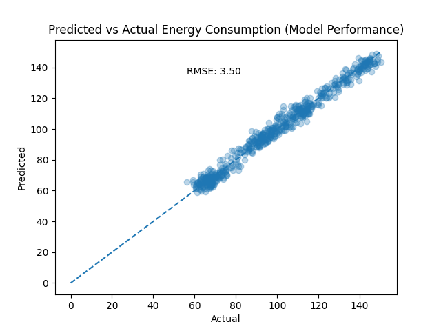
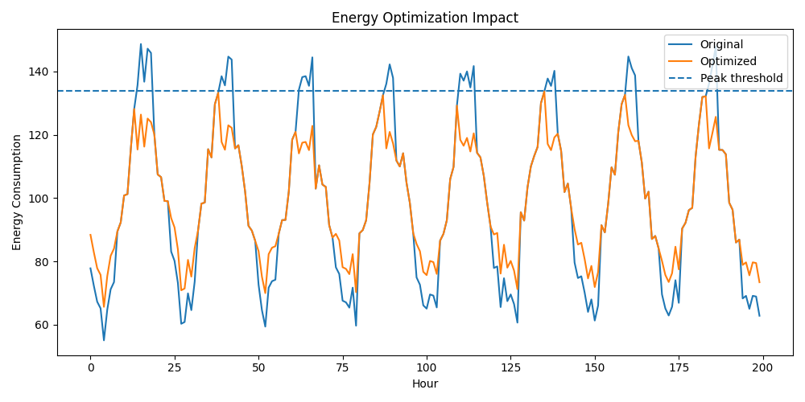

# ⚡ Energy Consumption Prediction & Peak Optimization

Live App • Machine Learning • Energy Systems

---

## 🚀 Overview

This project applies machine learning to predict building energy consumption and reduce peak demand through optimization strategies.

---

## 💼 Why This Matters

Energy systems face major challenges:

- High peak demand increases operational costs  
- Inefficient energy usage leads to waste  
- Grid stress impacts reliability  

Machine learning enables:

- Accurate demand forecasting  
- Smarter energy usage  
- Reduced peak loads  

---

## 🏭 Use Case

Applicable to:

- Smart buildings  
- Energy management systems  
- Industrial facilities  
- Grid demand optimization  

---

## 🎯 Key Results

- Built a full ML pipeline (data → model → optimization)  
- Predicted hourly energy consumption with **RMSE ≈ 3.5**  
- Reduced peak demand by **~14%**  
- Improved load distribution across time  

---

## 📊 Model Performance



---

## ⚡ Optimization Impact

Peak Demand Reduction  



---

## 🧠 Methodology

- Generated hourly energy dataset (temperature, occupancy)  
- Performed feature engineering  
- Trained a Random Forest Regressor  
- Evaluated performance using RMSE  
- Applied peak-shaving optimization strategy  
- Compared results before and after optimization  

---

## 🛠 Features

- Energy consumption prediction model  
- Peak demand optimization strategy  
- Visualization of consumption trends  
- End-to-end ML pipeline  
- Real-world inspired energy use case  

---

## 🧪 How to Run

### 1. Clone the repository

```bash
git clone https://github.com/hassanattout/energy-optimization-ml.git
cd energy-optimization-ml
```

### 2. Install dependencies
```bash
pip install -r requirements.txt
```

### 3. Run the project
```bash
python3 src/main.py
```

---

## 🗂️ Repository Structure
```text
energy-optimization-ml/
│
├── data/               # Dataset
├── models/             # Trained models
├── outputs/            # Results & visualizations
├── src/                # Source code
│
├── README.md
```

---

## 📌 Future Improvements

Use real-world datasets
Implement time-series models (LSTM, XGBoost)
Add real-time dashboard (Streamlit)
Improve optimization strategies

---

## 💡 Key Insight

Predicting energy consumption is useful.
👉 Optimizing it is where the real value lies.

---

## 👨‍💻 Author

Hassan Attout  
Machine Learning & Energy Systems  
LinkedIn: https://www.linkedin.com/in/hassanattout
