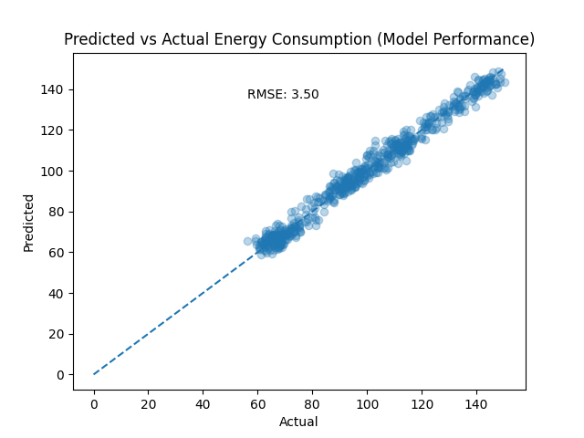
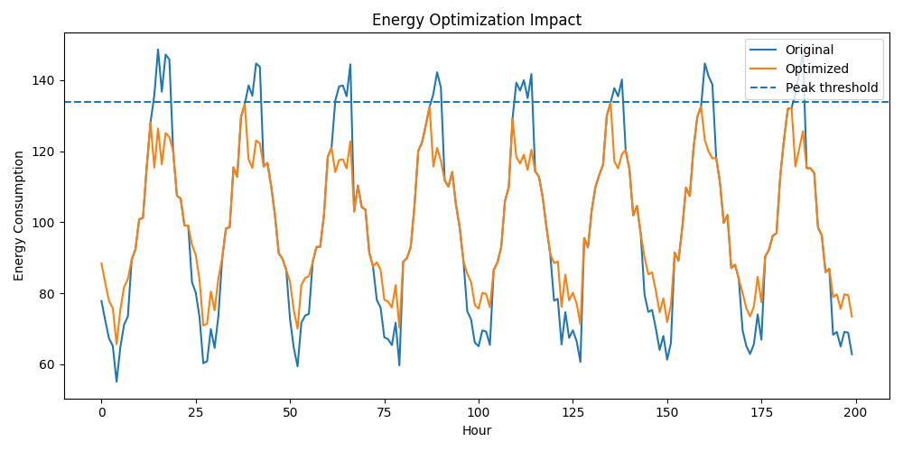

# Energy Consumption Forecasting and Peak Shaving

A reproducible educational pipeline that generates synthetic building-load data, trains a Random Forest forecasting model, and applies an energy-conserving peak-shaving heuristic.

> This is a simulation project, not a production energy-management system. Its results are based on synthetic data and should not be interpreted as measured savings from a real building.

## What the project demonstrates

- Reproducible synthetic time-series generation
- Chronological train/test evaluation
- Random Forest energy-consumption forecasting
- Load shifting from peak to off-peak periods
- Energy-balance verification
- Automated tests and continuous integration

## Method

The synthetic dataset contains hourly temperature, occupancy and energy consumption over 120 days. The first 80% of observations are used for training and the final 20% form a chronological holdout.

The peak-shaving stage is a transparent heuristic:

1. Identify consumption above the 85th percentile.
2. Reduce those peak observations by 15%.
3. Redistribute the removed energy across off-peak observations.
4. Verify that total energy is preserved.

This is load shifting, not energy elimination or a mathematically optimal control policy.

## Run locally

```bash
git clone https://github.com/hassanattout/energy-optimization-ml.git
cd energy-optimization-ml
python -m venv .venv
source .venv/bin/activate
pip install -r requirements.txt
python src/main.py
```

Run the tests with:

```bash
pytest -q
```

The pipeline regenerates:

- `data/data.csv`
- `models/model.pkl`
- `outputs/model.png`
- `outputs/optimization.png`

## Results

The exact forecasting RMSE and peak reduction are printed when the pipeline runs. A fixed random seed and chronological split make the experiment reproducible.





## Repository structure

```text
.
├── .github/workflows/ci.yml
├── data/
├── models/
├── outputs/
├── src/
│   ├── generate_data.py
│   ├── main.py
│   ├── optimize.py
│   └── train.py
├── tests/test_pipeline.py
├── requirements.txt
└── README.md
```

## Limitations and next steps

- Replace synthetic observations with an open building-energy dataset.
- Add lagged and calendar features without future-data leakage.
- Compare against naive and linear baselines.
- Report MAE, RMSE and confidence intervals.
- Formulate optimization with equipment limits, tariffs and comfort constraints.
- Evaluate peak demand and cost savings on unseen periods.

## Author

Hassan Attout  
Mechanical engineer focused on energy systems and applied AI  
[LinkedIn](https://www.linkedin.com/in/hassanattout)

## License

MIT
